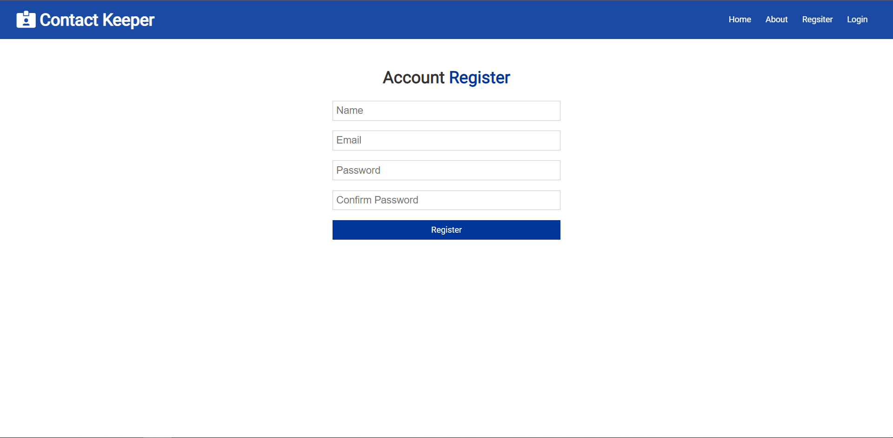
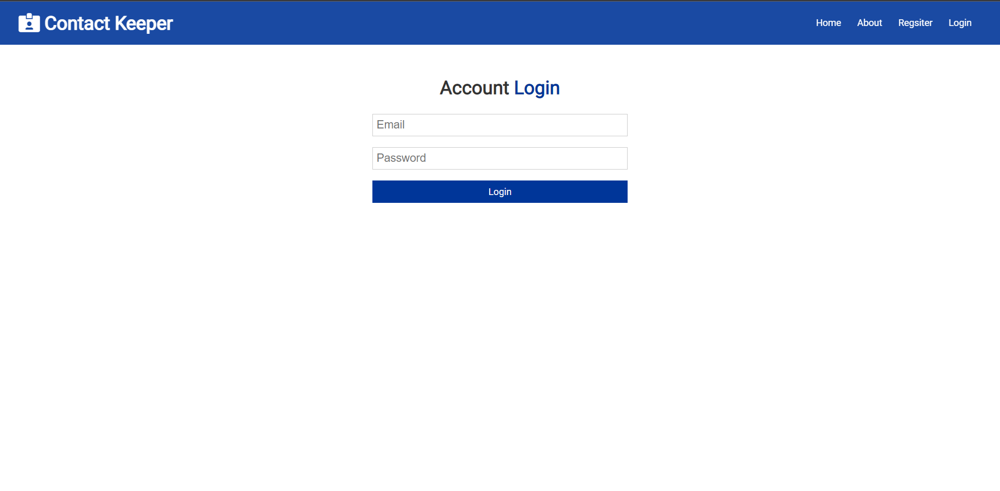
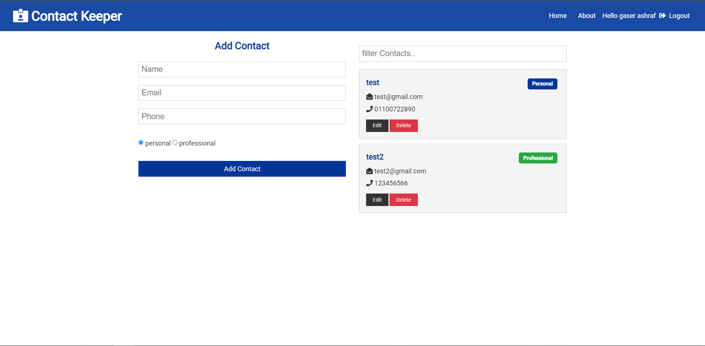

# Contact keeper
<p align="center">
  <a href="" rel="noopener">
 </a>
</p>
<p align="center" style='font-size:50px;font-weight:bold'>  Contact keeper
    <br> 
</p>


## 🏁 Get Started <a name = "Install"></a>

```
git clone https://github.com/gaserashraf/
```
```
npm install
```
```
npm run dev
```
## 💻 Built Using <a name = "tech"></a>
- **ReactJs**
- **Context API**
- **ExpressJS**
- **MongoDB**

## 📷 Screenshots



